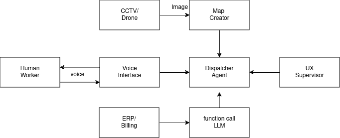

## Autonomous Warehouse

Phase 1 - Food Guardian AI

[HF-Demo](https://huggingface.co/spaces/gaganyatri/warehouse)

Using AI for Vision we can detect if fruits/vegetables are rotten. The system can take queries to return total loss, total damaged from day/week/month and notify user on which boxes have to be replaced.

We use Open Source code and weights running local machine for privacy. This sytem can be installed one existing machine, we recommend using a PC with GPU/Graphics Processing unit for fast analysis.

Phase 2 Involves processing CCTV videos over large period of tume. To build a time-series map related to efficiency of supermarker/warehouse.

[Phase 1 - Demo Presentaion](docs/demo_presentation.md)

- Setup
  - run with docker using GPU
    - docker compose -f foodguardian-compose.yml up -d
  - Visit  http://localhost:4173 on browser, to test the system

 

- [Version 1](version-1.md)

- [Frontend](frontend/README.md)

- [devpost tracker](https://devpost.com/software/drishti-09zpyk)

- Program challenge 

  - Challenge 3 - Eat HealthAI – AI for less food waste
    - Despite ever-increasing efforts, more than 11 million tons of food still end up in the trash every year in Germany alone because it is not sold in time before the expiration date and can therefore no longer be donated.
    - What technological solutions can be developed to reduce food waste and promote sustainability in retail? Consider using state-of-the-art industrial cameras, AI algorithms for image recognition and innovative systems for identifying and managing food that needs to be consumed urgently.
    - Challenge Partner: SICK AG

- Phase 2

  - Voice Dispatcher - for [AI - Agents 2.0 Hackathon](https://lu.ma/ai-agents-2.0)
  - Docker Setup
    - For CPU
      - docker compose -f cpu-compose.yml up -d
    - For GPU
      - docker compose -f gpu-compose.yml up -d
    - Build Frontend Docker
      - cd frontend
      - docker build --rm . -t slabstech/warehouse-ui -f Dockerfile
  - [Version 1](version-1.md)
  - [Frontend](frontend/README.md)

- Phase 3 - Ideas

  1. Use drone to map a warehouse . Create a 3d map along with items .
  2. Connect to Internal Api with function calling map metadata of items into 3d map
  3. Provide route list for the worker/robot with list of possible items which expire in 30/15/7 days
  4. Find state of Vegetable/fruits - Raw/Ripe/Spoilt

- References 
  - https://hack-now-2024.devpost.com/
  - https://de.nttdata-solutions.com/hack-now-2024
  - Hardware
    - https://github.com/BasedHardware
    - https://github.com/MULTI-ON
    - https://www.wur.nl/en/research-results/research-institutes/plant-research/greenhouse-horticulture/show-greenhouse/autonomous-greenhouse-challenge-4th-edition.htm
    - https://hackathon.sick.com/
